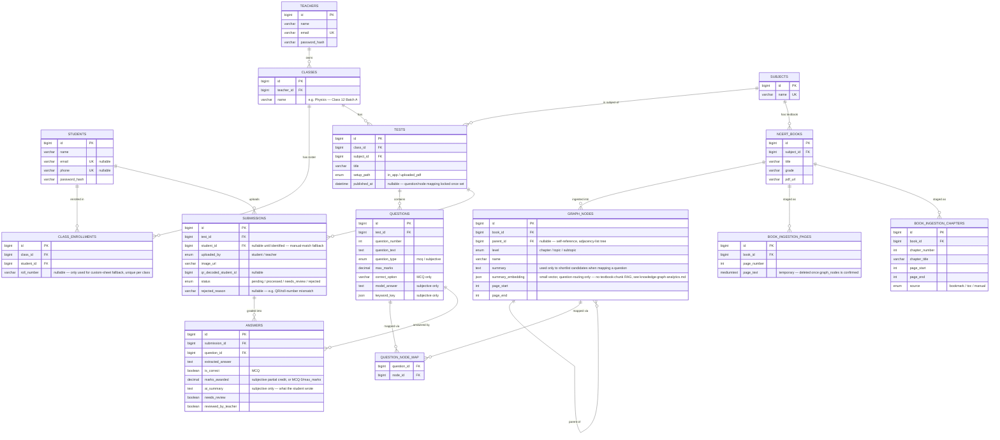

# Learning Management — Database Design (MySQL)

ER diagram and relational schema for the Learning Management platform: OMR/subjective test grading, a curriculum knowledge graph for subtopic-level weak-area reports, and the teacher/class/student roster underneath both.

**v1 — initial schema (2026-08-18).** Covers everything settled so far: [OMR-based grading](../omr-grading.md), [subjective grading](../subjective-grading.md), the [curriculum knowledge graph](../knowledge-graph-analytics.md), and [accounts/roster/tenancy](../accounts-and-roster.md). 11 tables, single database — no per-tenant database split is needed here (unlike SecurePass): a teacher's data isn't legally/physically isolated data belonging to a separate business, it's one row of scoping (`class.teacher_id`) inside one shared app, so row-level tenancy is the right level of isolation, not database-per-tenant.

---

## 1. Entity-Relationship Diagram



---

## 2. Table Summary & Relationships

| # | Table | Purpose | Key Relationships |
|---|-------|---------|-------------------|
| 1 | `teachers` | Teacher accounts | — |
| 2 | `students` | Student accounts | — |
| 3 | `classes` | A teacher's batch — the tenancy boundary (see [accounts-and-roster.md](../accounts-and-roster.md)) | teacher 1→N |
| 4 | `class_enrollments` | Roster: which students belong to which class, plus an optional per-class `roll_number` | class 1→N, student 1→N |
| 5 | `subjects` | Mathematics, Physics, etc. | — |
| 6 | `ncert_books` | One row per ingested NCERT textbook | subject 1→N |
| 7 | `graph_nodes` | Knowledge graph: Subject→Chapter→Topic→Subtopic tree, self-referencing | book 1→N, self 1→N (parent) |
| — | `book_ingestion_pages` | **Temporary staging** — per-page extracted book text, held only during ingestion of one book, deleted once its graph is confirmed | book 1→N |
| — | `book_ingestion_chapters` | **Temporary staging** — proposed chapter boundaries (from bookmarks/TOC/manual) before admin review confirms them into `graph_nodes` | book 1→N |
| 8 | `tests` | One test/exam within a class | class 1→N, subject 1→N |
| 9 | `questions` | Questions within a test, with answer key / model answer | test 1→N |
| 10 | `question_node_map` | Question → graph node(s), decided once at test setup | question N↔N, graph_node N↔N |
| 11 | `submissions` | One scanned/uploaded sheet per student per test | test 1→N, student 1→N |
| 12 | `answers` | One graded result per question per submission — the roll-up unit for the knowledge-graph report | submission 1→N, question 1→N |

No table stores marks on `graph_nodes` — the graph is shared, read-only reference data; every result lives on `answers` and only *references* a node via `questions` → `question_node_map`. See "Results never touch the graph" below.

---

## 3. Design Decisions

- **Row-level tenancy (`classes.teacher_id`), not database-per-tenant.** Unlike a SaaS product serving separate businesses (where physical isolation is a sales point, see SecurePass's `../../refrence/database-design.md`), every teacher here is a user inside one shared application — a `WHERE teacher_id = ?` (via `classes`) scoping every roster/test/result query is the right level of isolation. See [accounts-and-roster.md](../accounts-and-roster.md).
- **`roll_number` lives on `class_enrollments`, not `students`.** It's only meaningful — and only needs to be unique — *within one class's* custom-sheet scheme, never globally. `UNIQUE (class_id, roll_number)` enforces that directly. Most students never have it populated; it's a fallback field for one identification path, not a general account attribute.
- **Knowledge graph is an adjacency-list tree, not a separate graph database.** `graph_nodes.parent_id` self-references the same table. It's a strict tree with one small many-to-many exception (`question_node_map`) — a dedicated graph database (Neo4j etc.) would add a second datastore to keep in sync with everything else, for traversal patterns this tree doesn't need; worth revisiting only if cross-subject prerequisite links (a true graph, not a tree) become a real requirement later.
- **`level` is currently a fixed 3-value `ENUM` (chapter/topic/subtopic) — depth is still an open decision, not finalized.** At this fixed, known depth, walking or rolling up the tree is three plain self-joins, no recursion needed. If a level ever needs to go deeper, that's either a small bump to the `ENUM` (still fixed depth, still plain joins) or dropping the `ENUM` for open-ended depth (which then needs `WITH RECURSIVE`, MySQL 8.0.19+, plus an application-level check against `parent_id` cycles). See [knowledge-graph-analytics.md § Open Questions](../knowledge-graph-analytics.md#open-questions) for the full tradeoff — not resolved either way yet.
- **`summary_embedding` is a small JSON vector, not a full-textbook RAG/vector-DB setup.** Its only job is helping the AI shortlist candidate nodes when mapping a question at test setup — one short vector per node, computed once when the graph is ingested. There is deliberately no chunk-level embedding of the full NCERT text and no separate vector database: the report only needs to point at a page range (`page_start`/`page_end`), not generate content from the textbook itself. See [knowledge-graph-analytics.md § Non-Goals](../knowledge-graph-analytics.md#non-goals-for-now).
- **`summary_embedding` stays `NULL` until admin review confirms the node.** It's computed by a separate model/API call from the one that generates `name`/`summary`, and admin review can still rename or merge/split nodes after generation — embedding before confirmation risks embedding text that gets edited away. Populated in one batched call across every node in a book once its ingestion is confirmed, not per-node during chapter generation. See [knowledge-graph-analytics.md § Building the Graph](../knowledge-graph-analytics.md#building-the-graph-one-time-ingestion-per-subjectchapter).
- **Question → node mapping is locked at test setup, never re-classified.** `tests.published_at` marks that point; `question_node_map` rows don't change after a test goes live, regardless of how many students take it later.
- **Results never touch the graph.** Every graded result is a row in `answers`, referencing a `question_id` — which node(s) it counts toward is derived by joining through `question_node_map`, not stored redundantly on `answers` or written onto `graph_nodes`. Per-student and class-wide reports are both just different `GROUP BY` scopes over the same `answers` rows, computed on demand, not precomputed onto the graph.
- **Grading is mechanical, not AI, at submission time.** `answers.is_correct`/`marks_awarded` come from bubble-fill detection + answer-key comparison (MCQ) or OCR + AI partial-credit scoring against `questions.model_answer`/`keyword_key` (subjective) — the only AI cost in the whole pipeline happened once already, when `questions`/`question_node_map` were built at test setup. See [omr-grading.md](../omr-grading.md).
- **Submission identity can be null, briefly.** `submissions.student_id` is nullable to support the manual-match-to-roster fallback (teacher bulk-upload, no QR/roll-number on the sheet) — grading can run before identity is resolved, since it doesn't depend on knowing who the student is.
- **Mismatch rejection.** `submissions.qr_decoded_student_id` is compared against the uploading account's own ID; a mismatch sets `status = 'rejected'` with `rejected_reason` populated, before grading runs. See [accounts-and-roster.md § Rejecting a Mismatched Sheet](../accounts-and-roster.md#rejecting-a-mismatched-sheet-wrong-students-sheet-uploaded).
- **Book ingestion uses two temporary staging tables, not memory.** `book_ingestion_pages` (per-page extracted text) and `book_ingestion_chapters` (proposed chapter boundaries pending admin review) exist because ingestion spans multiple separate, human-paced requests — upload, review, edit, confirm — that can't rely on server memory surviving between them (process restarts, multiple server instances, or just the admin coming back later would all silently lose in-memory state). Both are plain tables rather than object-storage files: the data is small (a few hundred KB of text per book), and the review screen needs targeted row-level reads/edits (one chapter's page range, one page's text) that a table serves far more naturally than rewriting a flat file. Once a book's `graph_nodes` are confirmed, both tables' rows for that `book_id` are deleted — this is scratch data for building the graph, not part of it. See [knowledge-graph-analytics.md § Building the Graph](../knowledge-graph-analytics.md#building-the-graph-one-time-ingestion-per-subjectchapter).
- **No difficulty tagging.** Considered and deliberately dropped for v1 — an AI guess at difficulty is unreliable on its own; if added later, the better version is computed from real submitted results (`% of students who got a question right`), not a metadata field guessed at setup time. See [knowledge-graph-analytics.md § Non-Goals](../knowledge-graph-analytics.md#non-goals-for-now).

---

## 4. File Storage (Object Storage, Not the Database)

Neither `ncert_books.pdf_url` nor `submissions.image_url` is a "free" reference to something that just exists somewhere — both need a real file behind them, and the database only ever stores a pointer, never the file bytes.

- **`ncert_books.pdf_url` — our own copy, not a deep link to NCERT's site.** NCERT publishes its textbooks as free PDFs (no licensing cost), but "free to download" isn't the same as "safe to link to directly." Their site could restructure or move a file at any time, silently breaking every page pointer built from it — and ingestion (extracting text, see [knowledge-graph-analytics.md § Building the Graph](../knowledge-graph-analytics.md#building-the-graph-one-time-ingestion-per-subjectchapter)) needs to actually fetch and parse the file's bytes, which shouldn't depend on an external government site's uptime. So: download it once during ingestion, store our own copy in object storage (S3-compatible), and `pdf_url` points at that copy. **Not yet confirmed:** the exact terms under which NCERT permits re-hosting a copy (vs. only linking) — worth checking before this ships, not assumed either way.
- **`submissions.image_url` — mandatory object storage, no external source exists.** A student's scanned answer sheet is user-generated content with no free public copy anywhere — it has to be stored somewhere we control from the moment it's uploaded. Unlike NCERT books (a one-time cost per textbook, reused by everyone), this grows continuously with every submission, every test, every student.
- **Neither field can simply be dropped.** Ingestion needs the actual NCERT file bytes to extract text from; the report needs a real, working link for "go read this page"; a submission's image is the only record of what a student actually turned in. The database can only hold a pointer — the decision is *whose* copy it points to (ours vs. an external site's), not whether a real file needs to exist.
- **Cost is small in absolute terms** — a handful of NCERT textbook PDFs (tens of MB, one-time per book) plus individually small scanned images (a few hundred KB–few MB each, growing with usage) is standard, cheap object-storage usage on any major provider. Not a blocker, just infrastructure that needs to actually be provisioned rather than assumed away by a `VARCHAR` column.

---

## 5. MySQL DDL (Full Schema)

```sql
CREATE TABLE teachers (
    id BIGINT UNSIGNED AUTO_INCREMENT PRIMARY KEY,
    name VARCHAR(100) NOT NULL,
    email VARCHAR(150) NOT NULL UNIQUE,
    password_hash VARCHAR(255) NOT NULL,
    created_at DATETIME NOT NULL DEFAULT CURRENT_TIMESTAMP,
    updated_at DATETIME NOT NULL DEFAULT CURRENT_TIMESTAMP ON UPDATE CURRENT_TIMESTAMP
) ENGINE=InnoDB;

CREATE TABLE students (
    id BIGINT UNSIGNED AUTO_INCREMENT PRIMARY KEY,
    name VARCHAR(100) NOT NULL,
    email VARCHAR(150) NULL UNIQUE,
    phone VARCHAR(20) NULL UNIQUE,
    password_hash VARCHAR(255) NOT NULL,
    created_at DATETIME NOT NULL DEFAULT CURRENT_TIMESTAMP,
    updated_at DATETIME NOT NULL DEFAULT CURRENT_TIMESTAMP ON UPDATE CURRENT_TIMESTAMP,
    CONSTRAINT chk_student_has_contact CHECK (email IS NOT NULL OR phone IS NOT NULL)
) ENGINE=InnoDB;

CREATE TABLE classes (
    id BIGINT UNSIGNED AUTO_INCREMENT PRIMARY KEY,
    teacher_id BIGINT UNSIGNED NOT NULL COMMENT 'tenancy boundary — every roster/test/result query scopes through this',
    name VARCHAR(150) NOT NULL,
    created_at DATETIME NOT NULL DEFAULT CURRENT_TIMESTAMP,
    updated_at DATETIME NOT NULL DEFAULT CURRENT_TIMESTAMP ON UPDATE CURRENT_TIMESTAMP,
    FOREIGN KEY (teacher_id) REFERENCES teachers(id) ON DELETE RESTRICT,
    INDEX idx_classes_teacher (teacher_id)
) ENGINE=InnoDB;

-- roll_number is only meaningful per class (a tuition's own pre-existing
-- OMR sheet scheme, custom-template fallback) — unique per class, not
-- globally, and left NULL for every student on the default QR-code path.
CREATE TABLE class_enrollments (
    id BIGINT UNSIGNED AUTO_INCREMENT PRIMARY KEY,
    class_id BIGINT UNSIGNED NOT NULL,
    student_id BIGINT UNSIGNED NOT NULL,
    roll_number VARCHAR(20) NULL,
    enrolled_at DATETIME NOT NULL DEFAULT CURRENT_TIMESTAMP,
    FOREIGN KEY (class_id) REFERENCES classes(id) ON DELETE CASCADE,
    FOREIGN KEY (student_id) REFERENCES students(id) ON DELETE CASCADE,
    UNIQUE KEY uq_class_student (class_id, student_id),
    UNIQUE KEY uq_class_roll_number (class_id, roll_number)
) ENGINE=InnoDB;

CREATE TABLE subjects (
    id BIGINT UNSIGNED AUTO_INCREMENT PRIMARY KEY,
    name VARCHAR(100) NOT NULL UNIQUE
) ENGINE=InnoDB;

CREATE TABLE ncert_books (
    id BIGINT UNSIGNED AUTO_INCREMENT PRIMARY KEY,
    subject_id BIGINT UNSIGNED NOT NULL,
    title VARCHAR(150) NOT NULL,
    grade VARCHAR(20) NULL,
    pdf_url VARCHAR(500) NOT NULL,
    created_at DATETIME NOT NULL DEFAULT CURRENT_TIMESTAMP,
    FOREIGN KEY (subject_id) REFERENCES subjects(id) ON DELETE RESTRICT,
    INDEX idx_ncert_books_subject (subject_id)
) ENGINE=InnoDB;

-- Adjacency-list tree (Subject -> Chapter -> Topic -> Subtopic). Shared,
-- read-only reference data — never written to by grading. summary_embedding
-- is a SMALL per-node vector used only to shortlist candidates when mapping
-- a question at test setup; it is not a chunk-level RAG store (see
-- knowledge-graph-analytics.md § Non-Goals). Stored as JSON here since v1
-- doesn't need an ANN index at this scale — cosine similarity computed in
-- application code over a few hundred rows per subject is enough.
CREATE TABLE graph_nodes (
    id BIGINT UNSIGNED AUTO_INCREMENT PRIMARY KEY,
    book_id BIGINT UNSIGNED NOT NULL,
    parent_id BIGINT UNSIGNED NULL,
    level ENUM('chapter','topic','subtopic') NOT NULL,
    name VARCHAR(200) NOT NULL,
    summary TEXT NOT NULL,
    summary_embedding JSON NULL,
    page_start INT NULL,
    page_end INT NULL,
    created_at DATETIME NOT NULL DEFAULT CURRENT_TIMESTAMP,
    FOREIGN KEY (book_id) REFERENCES ncert_books(id) ON DELETE CASCADE,
    FOREIGN KEY (parent_id) REFERENCES graph_nodes(id) ON DELETE CASCADE,
    INDEX idx_graph_nodes_book (book_id),
    INDEX idx_graph_nodes_parent (parent_id)
) ENGINE=InnoDB;

-- Temporary staging: per-page extracted text for one book's ingestion,
-- kept page-indexed so a chapter's text can be produced by a plain slice
-- (WHERE page_number BETWEEN ...) once its boundaries are known. Rows for
-- a book_id are deleted once that book's graph_nodes are confirmed — this
-- is ingestion scratch data, never the permanent "book content" store
-- (see § Non-Goals in knowledge-graph-analytics.md).
CREATE TABLE book_ingestion_pages (
    id BIGINT UNSIGNED AUTO_INCREMENT PRIMARY KEY,
    book_id BIGINT UNSIGNED NOT NULL,
    page_number INT NOT NULL,
    page_text MEDIUMTEXT NOT NULL,
    FOREIGN KEY (book_id) REFERENCES ncert_books(id) ON DELETE CASCADE,
    UNIQUE KEY uq_book_page (book_id, page_number)
) ENGINE=InnoDB;

-- Temporary staging: proposed chapter boundaries, found via PDF bookmarks,
-- the book's own Table of Contents, or manual admin entry (source records
-- which). Admin-editable in the review screen before ingestion's per-chapter
-- AI step runs on them. Once confirmed, each row becomes exactly one
-- graph_nodes row at level='chapter'; deleted after that, same lifecycle
-- as book_ingestion_pages.
CREATE TABLE book_ingestion_chapters (
    id BIGINT UNSIGNED AUTO_INCREMENT PRIMARY KEY,
    book_id BIGINT UNSIGNED NOT NULL,
    chapter_number INT NOT NULL,
    chapter_title VARCHAR(200) NOT NULL,
    page_start INT NOT NULL,
    page_end INT NOT NULL,
    source ENUM('bookmark','toc','manual') NOT NULL,
    FOREIGN KEY (book_id) REFERENCES ncert_books(id) ON DELETE CASCADE,
    UNIQUE KEY uq_book_chapter (book_id, chapter_number)
) ENGINE=InnoDB;

CREATE TABLE tests (
    id BIGINT UNSIGNED AUTO_INCREMENT PRIMARY KEY,
    class_id BIGINT UNSIGNED NOT NULL,
    subject_id BIGINT UNSIGNED NOT NULL,
    title VARCHAR(150) NOT NULL,
    setup_path ENUM('in_app','uploaded_pdf') NOT NULL,
    source_pdf_url VARCHAR(500) NULL,
    published_at DATETIME NULL COMMENT 'once set, question_node_map rows for this test are locked — never re-classified',
    created_at DATETIME NOT NULL DEFAULT CURRENT_TIMESTAMP,
    FOREIGN KEY (class_id) REFERENCES classes(id) ON DELETE CASCADE,
    FOREIGN KEY (subject_id) REFERENCES subjects(id) ON DELETE RESTRICT,
    INDEX idx_tests_class (class_id)
) ENGINE=InnoDB;

CREATE TABLE questions (
    id BIGINT UNSIGNED AUTO_INCREMENT PRIMARY KEY,
    test_id BIGINT UNSIGNED NOT NULL,
    question_number INT NOT NULL,
    question_text TEXT NOT NULL,
    question_type ENUM('mcq','subjective') NOT NULL,
    max_marks DECIMAL(6,2) NOT NULL DEFAULT 1.00,
    correct_option VARCHAR(5) NULL COMMENT 'MCQ only — A/B/C/D',
    model_answer TEXT NULL COMMENT 'subjective only',
    keyword_key JSON NULL COMMENT 'subjective only — [{"keyword": "...", "weight": 2}, ...]',
    FOREIGN KEY (test_id) REFERENCES tests(id) ON DELETE CASCADE,
    UNIQUE KEY uq_test_question_number (test_id, question_number),
    INDEX idx_questions_test (test_id)
) ENGINE=InnoDB;

-- Question -> graph node, many-to-many (usually one node, occasionally two
-- for a question spanning subtopics). Set once at test setup, immutable
-- once the test is published.
CREATE TABLE question_node_map (
    question_id BIGINT UNSIGNED NOT NULL,
    node_id BIGINT UNSIGNED NOT NULL,
    PRIMARY KEY (question_id, node_id),
    FOREIGN KEY (question_id) REFERENCES questions(id) ON DELETE CASCADE,
    FOREIGN KEY (node_id) REFERENCES graph_nodes(id) ON DELETE RESTRICT,
    INDEX idx_question_node_map_node (node_id)
) ENGINE=InnoDB;

-- One row per uploaded sheet per student per test. student_id is nullable
-- to support the manual-match-to-roster fallback (grading can run before
-- identity is resolved). qr_decoded_student_id is compared against the
-- uploading account for the mismatch-rejection check — see
-- accounts-and-roster.md § Rejecting a Mismatched Sheet.
CREATE TABLE submissions (
    id BIGINT UNSIGNED AUTO_INCREMENT PRIMARY KEY,
    test_id BIGINT UNSIGNED NOT NULL,
    student_id BIGINT UNSIGNED NULL,
    uploaded_by ENUM('student','teacher') NOT NULL,
    image_url VARCHAR(500) NOT NULL,
    qr_decoded_student_id BIGINT UNSIGNED NULL,
    status ENUM('pending','processed','needs_review','rejected') NOT NULL DEFAULT 'pending',
    rejected_reason VARCHAR(200) NULL COMMENT 'e.g. "QR belongs to a different student"',
    created_at DATETIME NOT NULL DEFAULT CURRENT_TIMESTAMP,
    updated_at DATETIME NOT NULL DEFAULT CURRENT_TIMESTAMP ON UPDATE CURRENT_TIMESTAMP,
    FOREIGN KEY (test_id) REFERENCES tests(id) ON DELETE CASCADE,
    FOREIGN KEY (student_id) REFERENCES students(id) ON DELETE RESTRICT,
    UNIQUE KEY uq_test_student (test_id, student_id),
    INDEX idx_submissions_test (test_id)
) ENGINE=InnoDB;

-- The "Result record" the knowledge-graph rollup reads: one row per
-- question per submission. Which graph node(s) it counts toward is
-- derived via question_node_map, never stored redundantly here — the
-- graph itself is never written to (see § Design Decisions above).
CREATE TABLE answers (
    id BIGINT UNSIGNED AUTO_INCREMENT PRIMARY KEY,
    submission_id BIGINT UNSIGNED NOT NULL,
    question_id BIGINT UNSIGNED NOT NULL,
    extracted_answer TEXT NULL,
    is_correct BOOLEAN NULL COMMENT 'MCQ',
    marks_awarded DECIMAL(6,2) NULL COMMENT 'subjective partial credit, or MCQ 0/max_marks',
    ai_summary TEXT NULL COMMENT 'subjective only — what the student wrote',
    needs_review BOOLEAN NOT NULL DEFAULT FALSE,
    reviewed_by_teacher BOOLEAN NOT NULL DEFAULT FALSE,
    FOREIGN KEY (submission_id) REFERENCES submissions(id) ON DELETE CASCADE,
    FOREIGN KEY (question_id) REFERENCES questions(id) ON DELETE CASCADE,
    UNIQUE KEY uq_submission_question (submission_id, question_id),
    INDEX idx_answers_question (question_id)
) ENGINE=InnoDB;
```
