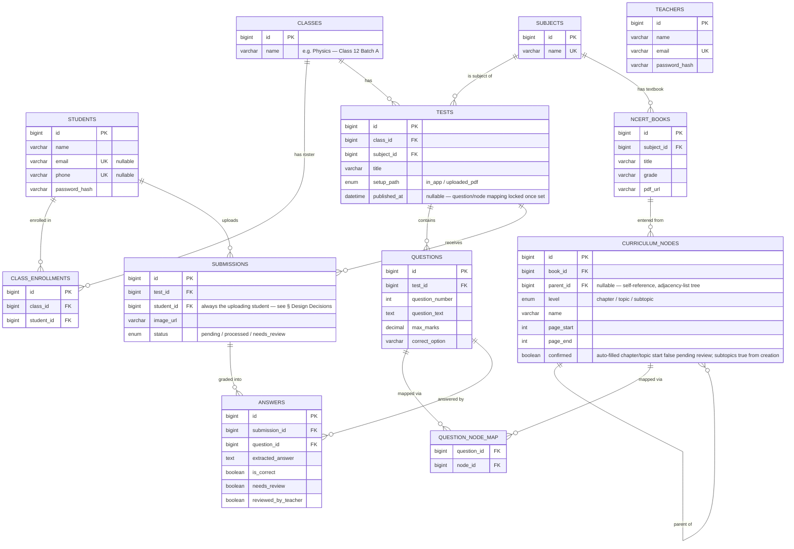

# Learning Management — Database Design (MySQL)

ER diagram and relational schema for the Learning Management platform: OMR test grading, a curriculum taxonomy for subtopic-level weak-area reports, and the teacher/class/student roster underneath both.

**v1 — schema.** Covers everything settled so far: [OMR-based grading](../omr-grading.md), the [curriculum taxonomy](../curriculum-taxonomy.md), and [accounts/roster/tenancy](../accounts-and-roster.md). **Scope: MCQ/OMR only** — [subjective grading](../subjective-grading.md) is fully out of scope for this PR (reviewer feedback), not just deferred-but-present: `model_answer`/`keyword_key`/`ai_summary`/`question_type` are removed from the schema entirely, to come back as their own PR once subjective grading is actually being built — see § Design Decisions. 10 tables, single database — no per-tenant database split is needed here (unlike SecurePass): a teacher's data isn't legally/physically isolated data belonging to a separate business, it's one shared app used by one trusted teaching staff, so a single shared database is the right level of isolation, not database-per-tenant (see § Design Decisions for the current, revised access-scoping approach).

---

## 1. Entity-Relationship Diagram



---

## 2. Table Summary & Relationships

| # | Table | Purpose | Key Relationships |
|---|-------|---------|-------------------|
| 1 | `teachers` | Teacher accounts | — |
| 2 | `students` | Student accounts | — |
| 3 | `classes` | A batch of students; no owning teacher — any teacher can manage any class (see [accounts-and-roster.md](../accounts-and-roster.md)) | — |
| 4 | `class_enrollments` | Roster: which students belong to which class | class 1→N, student 1→N |
| 5 | `subjects` | Mathematics, Physics, etc. | — |
| 6 | `ncert_books` | One row per book the curriculum taxonomy is entered from | subject 1→N |
| 7 | `curriculum_nodes` | Curriculum taxonomy: Chapter→Topic→Subtopic tree, self-referencing, manually entered (see [curriculum-taxonomy.md](../curriculum-taxonomy.md)) | book 1→N, self 1→N (parent) |
| 8 | `tests` | One test/exam within a class | class 1→N, subject 1→N |
| 9 | `questions` | Questions within a test, with answer key / model answer | test 1→N |
| 10 | `question_node_map` | Question → curriculum node(s), decided once at test setup | question N↔N, curriculum_node N↔N |
| 11 | `submissions` | One scanned/uploaded sheet per student per test | test 1→N, student 1→N |
| 12 | `answers` | One graded result per question per submission — the roll-up unit for the taxonomy report | submission 1→N, question 1→N |

No table stores marks on `curriculum_nodes` — the taxonomy is shared, read-only reference data; every result lives on `answers` and only *references* a node via `questions` → `question_node_map`. See "Results never touch the taxonomy" below.

---

## 3. Design Decisions

- **One shared database, not database-per-tenant.** Unlike a SaaS product serving separate businesses (where physical isolation is a sales point, see SecurePass's `../../refrence/database-design.md`), every teacher here is a user inside one shared application, so a single shared database is the right level of isolation.
- **No `classes.teacher_id`, no per-teacher access scoping.** `classes` originally had a `teacher_id` FK (recording who created it) plus `WHERE teacher_id = ?` scoping on every roster/test/result query. Both were removed, not just unused: no route or repository call checked ownership anymore, and nothing displayed "created by" anywhere (no frontend yet), so the column was purely unused — same reasoning as dropping `roll_number` below. This can be added back if the product ever needs it — re-add `teacher_id` (or a `class_teachers` join table, for actual co-teaching) and the `WHERE`-clause scoping described in the superseded model — see [accounts-and-roster.md § Tenancy Model](../accounts-and-roster.md) for the full reasoning and what "adding it back" would look like.
- **No `roll_number`, QR code, or sheet-based identification in v1.** MVP identification is login-only — a student uploads their own sheet under their own account, so nothing on the sheet itself needs to identify them, and no standardized template is required (`../omr-grading.md`, current version). These fields were designed and then deliberately removed rather than kept-but-unused, once `../omr-grading.md` §29 confirmed standardized templates/QR/bulk-upload are a named future phase, not MVP scope — add `roll_number` (on `class_enrollments`, unique per class) and a QR-mismatch check back when that phase is actually built. See [accounts-and-roster.md § Future / Phase 2](../accounts-and-roster.md#future--phase-2--teacher-bulk-upload--sheet-based-identification).
- **Renamed "knowledge graph" → "curriculum taxonomy," table renamed `graph_nodes` → `curriculum_nodes`.** On review, the structure never had multiple relationship types, cross-links, or AI-derived content — it's a plain manually-curated tree, and "graph" overstated that. See [curriculum-taxonomy.md § History](../curriculum-taxonomy.md#history--why-this-simplified-so-much) for the full reasoning.
- **No `summary`/`summary_embedding` columns, no `book_ingestion_pages`/`book_ingestion_chapters` staging tables, no automated ingestion pipeline.** All dropped, not deferred. The catalog is small and fixed (12 subject-class combinations, 5–10 chapters each), Chapter/Topic names are already printed in the book's own table of contents (no AI judgment needed, no failure mode where AI beats the printed page), and Subtopic — the one level needing real judgment — is a small enough volume (~500–1000 entries total) for direct manual entry by the teacher to be more reliable than an unvalidated AI classification step. See [curriculum-taxonomy.md § History](../curriculum-taxonomy.md#history--why-this-simplified-so-much).
- **`curriculum_nodes.confirmed`** replaces the old staging-table review flow. Chapter/Topic rows auto-filled by plain PDF bookmark/table-of-contents parsing (not AI — just reading structured data already in the file) start `confirmed = false`; the teacher reviews and confirms or corrects them. Subtopic rows are always manually typed by the teacher and start `confirmed = true` — there's nothing to review since a person entered it directly. This removes the need for separate staging tables entirely: proposed and confirmed data live in the same table, just gated by one boolean.
- **No `IEmbeddingService`/embedding provider anywhere in the architecture.** It existed to shortlist candidate nodes before an AI call at question-mapping time — unnecessary once one subject's whole taxonomy (a few hundred short name+path entries, no lengthy summaries) is small enough to send directly in a single prompt. See [curriculum-taxonomy.md § Mapping Questions onto the Taxonomy](../curriculum-taxonomy.md#mapping-questions-onto-the-taxonomy).
- **`level` is a fixed 3-value `ENUM` (chapter/topic/subtopic) — locked, checked against real NCERT content.** A Class 10 Maths chapter ("Circles") confirmed a Subtopic is already a single atomic, testable idea — nothing meaningful to split further, and going deeper would only dilute the "Insufficient Data" reporting threshold and multiply manual-entry workload. At this fixed, known depth, walking or rolling up the tree is three plain self-joins, no recursion needed. See [curriculum-taxonomy.md § Open Questions](../curriculum-taxonomy.md#open-questions) for the full reasoning.
- **Question → node mapping is locked at test setup, never re-classified.** `tests.published_at` marks that point; `question_node_map` rows don't change after a test goes live, regardless of how many students take it later.
- **Results never touch the taxonomy.** Every graded result is a row in `answers`, referencing a `question_id` — which node(s) it counts toward is derived by joining through `question_node_map`, not stored redundantly on `answers` or written onto `curriculum_nodes`. Per-student and class-wide reports are both just different `GROUP BY` scopes over the same `answers` rows, computed on demand, not precomputed onto the taxonomy.
- **Grading is mechanical, not AI, at submission time.** `answers.is_correct` comes from bubble-fill detection + answer-key comparison — the only AI cost in the whole pipeline is the one-time question-mapping call at test setup. See [omr-grading.md](../omr-grading.md).
- **`question_type`, `model_answer`, `keyword_key`, `ai_summary`, `marks_awarded` are removed entirely, not kept as unused nullable columns.** An earlier draft argued these were cheap enough to keep around "just in case" — reversed on review: subjective grading is a fully separate future PR, not a deferred piece of this one, so the schema for this PR should only describe what it actually builds (MCQ/OMR). `questions` has no type discriminator since every question in scope is MCQ; `answers.is_correct` alone is sufficient for MCQ scoring (score = `is_correct ? max_marks : 0`), so `marks_awarded` isn't needed here either — it was only ever justified by subjective's variable partial credit. All of these come back together, as real columns backing real functionality, when subjective grading is actually built.
- **`submissions.student_id` is always the uploading student, never nullable.** In v1, a student only ever uploads their own sheet under their own login — there's no teacher-bulk-upload path yet, so there's nothing to resolve identity for later. This was `NULL`-able in an earlier draft to support a manual-match-to-roster fallback; that fallback (along with the QR-mismatch rejection check) only comes back once teacher bulk-upload is actually built (see the `roll_number`/QR decision above).
- **No `test_layout_templates` table in v1 — extraction reads every sheet directly, no cached layout.** An earlier draft added this table for a cached-template/CV-first design; that approach is now a documented future optimization, not the v1 build, since it carried unvalidated registration/threshold risk that a simpler AI-vision-reads-every-sheet approach avoids entirely. See [omr-extraction-strategy.md § Future Optimization](omr-extraction-strategy.md#future-optimization-not-v1-cached-template-cv-first-detection) for the deferred design and the schema it would need if revisited. **v1 assumes a single-page OMR sheet** (a single `submissions.image_url`) — a multi-page bubble sheet isn't supported yet.
- **`submissions.image_url` is a single column, not a one-to-many `submission_pages` table — reverted back after a closer look.** A multi-page relation was added, then removed: it exists to support multi-page subjective booklets, which aren't in scope right now. Building that structure now would be exactly the kind of unused-until-later complexity avoided everywhere else in this schema — reintroduce a multi-page relation when subjective grading is actually being built and multi-page is confirmed necessary, not before. Whenever multi-page support does come back, it should still be plain per-page images, not a bundled PDF — see [omr-extraction-strategy.md § Input format](omr-extraction-strategy.md#input-format) for why.
- **No difficulty tagging.** Considered and deliberately dropped for v1 — an AI guess at difficulty is unreliable on its own; if added later, the better version is computed from real submitted results (`% of students who got a question right`), not a metadata field guessed at setup time.

---

## 4. File Storage (Object Storage, Not the Database)

Neither `ncert_books.pdf_url` nor `submissions.image_url` is a "free" reference to something that just exists somewhere — both need a real file behind them, and the database only ever stores a pointer, never the file bytes.

- **Processing (both books and submissions) uses a temp file, settled, independent of the permanent-storage question below.** An uploaded PDF/image is written to OS-managed temp storage (e.g. Python's `tempfile`) as it's received — never fully buffered in application memory — and whatever reads it (the PDF bookmark/TOC parser, the CV/OCR service) works off that temp file. The temp file is auto-cleaned once processing is done, or on a schedule if something crashes mid-way. This part doesn't depend on whether a permanent copy gets kept afterward.
- **`ncert_books.pdf_url` — whether we keep a permanent copy at all is genuinely undecided, not settled.** NCERT publishes textbooks as free PDFs (no licensing cost), but "free to download" isn't the same as "safe to link to directly." Their site could restructure or move a file at any time, breaking any page pointer built from it. Keeping our own permanent copy avoids that, at a small ongoing storage cost. Not keeping one is also possible if the "go read pages 120–125" link is allowed to depend on NCERT's own site staying stable. **Neither option is decided yet** — and if NCERT re-hosting terms turn out to disallow keeping our own copy, that would force the decision anyway.
- **`submissions.image_url` — mandatory object storage, no external source exists.** A student's scanned answer sheet is user-generated content with no free public copy anywhere — it has to be stored somewhere we control from the moment it's uploaded, for as long as it needs to remain available (e.g., for a teacher's manual review or a later dispute).
- **Cost, if we do keep permanent copies, is small** — a handful of NCERT textbook PDFs (tens of MB, one-time per book) plus individually small scanned images (a few hundred KB–few MB each, growing with usage) is standard, cheap object-storage usage on any major provider.

---

## 5. MySQL DDL (Full Schema)

```sql
CREATE TABLE teachers (
    id BIGINT UNSIGNED AUTO_INCREMENT PRIMARY KEY,
    name VARCHAR(100) NOT NULL,
    email VARCHAR(150) NOT NULL UNIQUE,
    password_hash VARCHAR(255) NOT NULL,
    created_at DATETIME NOT NULL DEFAULT CURRENT_TIMESTAMP,
    updated_at DATETIME NOT NULL DEFAULT CURRENT_TIMESTAMP ON UPDATE CURRENT_TIMESTAMP
) ENGINE=InnoDB;

CREATE TABLE students (
    id BIGINT UNSIGNED AUTO_INCREMENT PRIMARY KEY,
    name VARCHAR(100) NOT NULL,
    email VARCHAR(150) NULL UNIQUE,
    phone VARCHAR(20) NULL UNIQUE,
    password_hash VARCHAR(255) NOT NULL,
    created_at DATETIME NOT NULL DEFAULT CURRENT_TIMESTAMP,
    updated_at DATETIME NOT NULL DEFAULT CURRENT_TIMESTAMP ON UPDATE CURRENT_TIMESTAMP,
    CONSTRAINT chk_student_has_contact CHECK (email IS NOT NULL OR phone IS NOT NULL)
) ENGINE=InnoDB;

CREATE TABLE classes (
    id BIGINT UNSIGNED AUTO_INCREMENT PRIMARY KEY,
    name VARCHAR(150) NOT NULL,
    created_at DATETIME NOT NULL DEFAULT CURRENT_TIMESTAMP,
    updated_at DATETIME NOT NULL DEFAULT CURRENT_TIMESTAMP ON UPDATE CURRENT_TIMESTAMP
) ENGINE=InnoDB;

-- No roll_number in v1 — identification is login-only (see § Design
-- Decisions). Add it back (unique per class) when teacher bulk-upload
-- with sheet-based identification is actually built.
CREATE TABLE class_enrollments (
    id BIGINT UNSIGNED AUTO_INCREMENT PRIMARY KEY,
    class_id BIGINT UNSIGNED NOT NULL,
    student_id BIGINT UNSIGNED NOT NULL,
    enrolled_at DATETIME NOT NULL DEFAULT CURRENT_TIMESTAMP,
    FOREIGN KEY (class_id) REFERENCES classes(id) ON DELETE CASCADE,
    FOREIGN KEY (student_id) REFERENCES students(id) ON DELETE CASCADE,
    UNIQUE KEY uq_class_student (class_id, student_id)
) ENGINE=InnoDB;

CREATE TABLE subjects (
    id BIGINT UNSIGNED AUTO_INCREMENT PRIMARY KEY,
    name VARCHAR(100) NOT NULL UNIQUE
) ENGINE=InnoDB;

CREATE TABLE ncert_books (
    id BIGINT UNSIGNED AUTO_INCREMENT PRIMARY KEY,
    subject_id BIGINT UNSIGNED NOT NULL,
    title VARCHAR(150) NOT NULL,
    grade VARCHAR(20) NULL,
    pdf_url VARCHAR(500) NOT NULL,
    created_at DATETIME NOT NULL DEFAULT CURRENT_TIMESTAMP,
    FOREIGN KEY (subject_id) REFERENCES subjects(id) ON DELETE RESTRICT,
    INDEX idx_ncert_books_subject (subject_id)
) ENGINE=InnoDB;

-- Adjacency-list tree (Chapter -> Topic -> Subtopic), manually entered —
-- see curriculum-taxonomy.md. No summary/embedding columns: matching a
-- question to a node uses the node's own name + path directly, not an
-- authored description. confirmed distinguishes auto-filled Chapter/Topic
-- rows (from PDF bookmark/TOC parsing, pending teacher review) from
-- Subtopic rows (always manually typed, confirmed from creation).
CREATE TABLE curriculum_nodes (
    id BIGINT UNSIGNED AUTO_INCREMENT PRIMARY KEY,
    book_id BIGINT UNSIGNED NOT NULL,
    parent_id BIGINT UNSIGNED NULL,
    level ENUM('chapter','topic','subtopic') NOT NULL,
    name VARCHAR(200) NOT NULL,
    page_start INT NULL,
    page_end INT NULL,
    confirmed BOOLEAN NOT NULL DEFAULT TRUE,
    created_at DATETIME NOT NULL DEFAULT CURRENT_TIMESTAMP,
    FOREIGN KEY (book_id) REFERENCES ncert_books(id) ON DELETE CASCADE,
    FOREIGN KEY (parent_id) REFERENCES curriculum_nodes(id) ON DELETE CASCADE,
    INDEX idx_curriculum_nodes_book (book_id),
    INDEX idx_curriculum_nodes_parent (parent_id)
) ENGINE=InnoDB;

CREATE TABLE tests (
    id BIGINT UNSIGNED AUTO_INCREMENT PRIMARY KEY,
    class_id BIGINT UNSIGNED NOT NULL,
    subject_id BIGINT UNSIGNED NOT NULL,
    title VARCHAR(150) NOT NULL,
    setup_path ENUM('in_app','uploaded_pdf') NOT NULL,
    source_pdf_url VARCHAR(500) NULL,
    published_at DATETIME NULL COMMENT 'once set, question_node_map rows for this test are locked — never re-classified',
    created_at DATETIME NOT NULL DEFAULT CURRENT_TIMESTAMP,
    FOREIGN KEY (class_id) REFERENCES classes(id) ON DELETE CASCADE,
    FOREIGN KEY (subject_id) REFERENCES subjects(id) ON DELETE RESTRICT,
    INDEX idx_tests_class (class_id)
) ENGINE=InnoDB;

-- No test_layout_templates table in v1 — see § Design Decisions above and
-- omr-extraction-strategy.md § Future Optimization for the deferred
-- cached-template design and the schema it would need if ever revisited.

-- MCQ only — no question_type discriminator, no model_answer/keyword_key.
-- Subjective grading is its own future PR; these come back together then,
-- not as unused columns kept around now. See § Design Decisions.
CREATE TABLE questions (
    id BIGINT UNSIGNED AUTO_INCREMENT PRIMARY KEY,
    test_id BIGINT UNSIGNED NOT NULL,
    question_number INT NOT NULL,
    question_text TEXT NOT NULL,
    max_marks DECIMAL(6,2) NOT NULL DEFAULT 1.00,
    correct_option VARCHAR(5) NOT NULL COMMENT 'A/B/C/D',
    FOREIGN KEY (test_id) REFERENCES tests(id) ON DELETE CASCADE,
    UNIQUE KEY uq_test_question_number (test_id, question_number),
    INDEX idx_questions_test (test_id)
) ENGINE=InnoDB;

-- Question -> curriculum node, many-to-many (usually one node, occasionally
-- two for a question spanning subtopics). Set once at test setup, immutable
-- once the test is published.
CREATE TABLE question_node_map (
    question_id BIGINT UNSIGNED NOT NULL,
    node_id BIGINT UNSIGNED NOT NULL,
    PRIMARY KEY (question_id, node_id),
    FOREIGN KEY (question_id) REFERENCES questions(id) ON DELETE CASCADE,
    FOREIGN KEY (node_id) REFERENCES curriculum_nodes(id) ON DELETE RESTRICT,
    INDEX idx_question_node_map_node (node_id)
) ENGINE=InnoDB;

-- One row per uploaded sheet per student per test. student_id is always
-- the uploading student's own id (login-only identification, v1) — see
-- § Design Decisions for what comes back once teacher bulk-upload ships.
-- image_url is a single column, not a one-to-many page relation — v1 is
-- single-page OMR only. Revisit as a submission_pages table if/when
-- multi-page subjective booklets are actually being built (still per-page
-- images then too, not a bundled PDF — see § Design Decisions above).
CREATE TABLE submissions (
    id BIGINT UNSIGNED AUTO_INCREMENT PRIMARY KEY,
    test_id BIGINT UNSIGNED NOT NULL,
    student_id BIGINT UNSIGNED NOT NULL,
    image_url VARCHAR(500) NOT NULL,
    status ENUM('pending','processed','needs_review') NOT NULL DEFAULT 'pending',
    created_at DATETIME NOT NULL DEFAULT CURRENT_TIMESTAMP,
    updated_at DATETIME NOT NULL DEFAULT CURRENT_TIMESTAMP ON UPDATE CURRENT_TIMESTAMP,
    FOREIGN KEY (test_id) REFERENCES tests(id) ON DELETE CASCADE,
    FOREIGN KEY (student_id) REFERENCES students(id) ON DELETE RESTRICT,
    UNIQUE KEY uq_test_student (test_id, student_id),
    INDEX idx_submissions_test (test_id)
) ENGINE=InnoDB;

-- The "Result record" the curriculum-taxonomy rollup reads: one row per
-- question per submission. Which node(s) it counts toward is derived via
-- question_node_map, never stored redundantly here — the taxonomy itself
-- is never written to (see § Design Decisions above).
-- No marks_awarded/ai_summary — MCQ scoring is fully derived from is_correct
-- (score = is_correct ? questions.max_marks : 0). Both come back when
-- subjective grading (variable partial credit, written-answer summaries)
-- is actually built, as their own PR.
CREATE TABLE answers (
    id BIGINT UNSIGNED AUTO_INCREMENT PRIMARY KEY,
    submission_id BIGINT UNSIGNED NOT NULL,
    question_id BIGINT UNSIGNED NOT NULL,
    extracted_answer TEXT NULL,
    is_correct BOOLEAN NULL,
    needs_review BOOLEAN NOT NULL DEFAULT FALSE,
    reviewed_by_teacher BOOLEAN NOT NULL DEFAULT FALSE,
    FOREIGN KEY (submission_id) REFERENCES submissions(id) ON DELETE CASCADE,
    FOREIGN KEY (question_id) REFERENCES questions(id) ON DELETE CASCADE,
    UNIQUE KEY uq_submission_question (submission_id, question_id),
    INDEX idx_answers_question (question_id)
) ENGINE=InnoDB;
```
