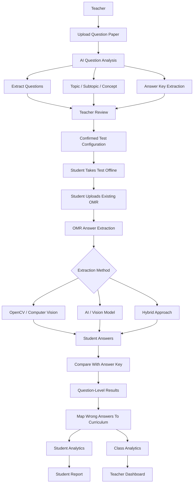
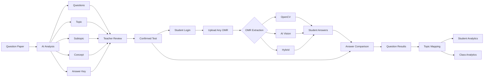

# OMR-Based Offline Test Grading & Topic Analytics

An offline assessment and learning-analytics platform for tuition classes that allows students to take traditional pen-and-paper MCQ tests and receive detailed performance insights without requiring the tuition to change its existing OMR infrastructure.

The platform is designed for **Classes 8, 9, and 10** and supports:

* Mathematics
* Science
* Social Science
* English

The system is intentionally designed to support **different OMR sheet formats** used by different tuition classes.

The current MVP does **not require a standardized OMR template**.

---

# 1. Vision

The goal is not simply to automate marks calculation.

The goal is to answer:

### For the student

> **What exactly am I weak at?**

For example:

```text
Mathematics
└── Geometry
    └── Circles
        └── Tangents
            Accuracy: 35% 🔴
```

### For the teacher

> **What exactly does my class need to re-teach?**

For example:

```text
Class 10 Mathematics

Geometry → Circles → Tangents

34 / 48 students struggling
Class accuracy: 42%
```

The system connects:

```text
Question
   ↓
Curriculum Topic
   ↓
Student Answer
   ↓
Correct / Wrong
   ↓
Weak Topic
```

---

# 2. Core System Flow



---

# 3. Important MVP Decision: OMR Format Is NOT Fixed

Different tuition classes may already have their own OMR sheets.

For example:

```text
Tuition A
Q1 → A B C D
Q2 → A B C D
Q3 → A B C D
```

while another tuition may have:

```text
Tuition B
1. A ○  B ●  C ○  D ○

2. A ○  B ○  C ●  D ○
```

Another may use:

* Different bubble sizes
* Different layouts
* Multiple columns
* Different question numbering
* Different page sizes
* Different positioning
* Different answer choices
* OMR PDFs
* Scanned images
* Phone photographs

Therefore, the MVP should **not depend on one fixed OMR template**.

---

# 4. Student Identification

The student does not need to be identified from the OMR sheet.

The student is already authenticated in the application.

The flow is:

```text
Student Login
     ↓
Student Account Identified
     ↓
Student Selects Test
     ↓
Student Uploads OMR
     ↓
Submission automatically belongs to that student
```

Therefore, the system does not currently require:

* QR code on OMR
* Roll-number bubbles
* Student-name OCR
* Manual student matching

This significantly simplifies the MVP.

---

# 5. OMR Answer Extraction

The system only requires one final output from the uploaded OMR:

```text
Question Number → Selected Answer
```

For example:

```json
{
  "1": "B",
  "2": "C",
  "3": "A",
  "4": "D",
  "5": "B"
}
```

How this output is generated is an **implementation decision**.

The developer may choose:

### Option A — OpenCV / Computer Vision

Use image processing techniques such as:

* Image preprocessing
* Thresholding
* Contour detection
* Bubble detection
* Region detection
* Fill-percentage analysis
* Perspective correction
* Template/layout inference

This is preferred when the OMR structure is regular and visually predictable.

---

### Option B — AI / Vision Model

Use a vision-capable AI model to inspect the uploaded OMR and extract:

```text
Q1 → B
Q2 → C
Q3 → A
Q4 → D
```

This may be useful when:

* OMR layouts vary
* The sheet has no standard template
* Bubble positions are difficult to detect programmatically
* Images are photographed at different angles
* Multiple OMR designs must be supported quickly

---

### Option C — Hybrid

The system can combine both.

For example:

```text
OMR Image
    ↓
OpenCV preprocessing
    ↓
Crop / straighten / improve image
    ↓
AI Vision
    ↓
Answer extraction
    ↓
Validation
```

Or:

```text
OMR Image
    ↓
OpenCV detects candidate bubbles
    ↓
AI validates ambiguous questions
    ↓
Final Answers
```

---

# 6. Developer Choice

The implementation should **not prescribe OpenCV or AI as a mandatory technology**.

The requirement is:

> **Given a student's uploaded OMR sheet, extract the selected answer for each question as reliably as possible.**

The developer may choose:

```text
OpenCV
   OR
AI Vision
   OR
OpenCV + AI
```

based on:

* Accuracy
* OMR complexity
* Image quality
* Cost
* Processing time
* Ease of implementation
* Reliability

The rest of the system should remain independent of the extraction method.

---

# 7. Extraction Interface

Regardless of the implementation, the OMR extraction layer should produce a common output.

For example:

```json
{
  "studentId": "student_123",
  "testId": "test_456",
  "answers": {
    "1": "B",
    "2": "C",
    "3": "A",
    "4": "D",
    "5": "B"
  }
}
```

This means the grading system does not care whether the answers came from:

```text
OpenCV
```

or:

```text
AI Vision
```

or:

```text
OpenCV + AI
```

This keeps the architecture modular.

---

# 8. OMR Confidence and Manual Review

OMR extraction may sometimes be uncertain.

Examples:

### Clear answer

```text
Q1 → B
Confidence: High
```

### Double mark

```text
Q2 → B / C
Confidence: Low
```

### Poor image

```text
Q3 → Unknown
Confidence: Low
```

The system should not silently make unreliable decisions.

Instead:

```text
OMR Extraction
      ↓
Confidence Check
      ↓
 ┌────┴────┐
High      Low
 │          │
 ▼          ▼
Accept    Manual Review
```

A teacher can correct the uncertain answers.

---

# 9. Question Paper Analysis

The question paper is analyzed separately from the OMR.

The teacher uploads:

```text
Question Paper PDF
```

The AI extracts:

* Question number
* Question text
* Answer
* Subject
* Topic
* Subtopic
* Concept

Example:

```json
{
  "questionNumber": 12,
  "questionText": "A tangent is drawn...",
  "correctAnswer": "B",
  "subject": "Mathematics",
  "topic": "Geometry",
  "subtopic": "Circles",
  "concept": "Tangents"
}
```

---

# 10. AI-Powered Curriculum Classification

The AI should not freely invent arbitrary topics.

The application should maintain a curriculum taxonomy for:

```text
Class 8
Class 9
Class 10
```

and:

```text
Mathematics
Science
Social Science
English
```

The AI maps each question into this predefined hierarchy.

---

# 11. Curriculum Hierarchy

The general structure is:

```text
Subject
   ↓
Topic / Chapter
   ↓
Subtopic
   ↓
Concept
```

Example:

```text
Mathematics
└── Geometry
    └── Circles
        ├── Chords
        ├── Angles
        ├── Tangents
        └── Cyclic Properties
```

Another example:

```text
Science
└── Physics
    └── Electricity
        ├── Current
        ├── Potential Difference
        ├── Resistance
        └── Ohm's Law
```

Social Science:

```text
Social Science
└── History
    └── Nationalism
        ├── Nationalism in Europe
        ├── Indian Nationalism
        └── National Movement
```

English:

```text
English
└── Grammar
    ├── Tenses
    ├── Modals
    ├── Reported Speech
    └── Subject-Verb Agreement
```

The exact curriculum taxonomy should be maintained according to the relevant NCERT syllabus for the selected class and subject.

---

# 12. Teacher Review

AI-generated classification should be reviewed before the test becomes active.

Example:

| Question | Answer | Topic      | Subtopic      | Concept       |
| -------- | ------ | ---------- | ------------- | ------------- |
| Q1       | B      | Algebra    | Polynomials   | Factorisation |
| Q2       | C      | Geometry   | Circles       | Tangents      |
| Q3       | A      | Geometry   | Triangles     | Similarity    |
| Q4       | D      | Statistics | Data Handling | Mean          |

The teacher can edit any field.

After confirmation:

```text
AI Extraction
      ↓
Teacher Review
      ↓
Confirmed Curriculum Mapping
      ↓
Used for Analytics
```

---

# 13. Answer Key Extraction

The answer key can be obtained using whichever method is most reliable for the uploaded paper.

### If the PDF contains machine-readable answers

Use standard PDF/text extraction.

Example:

```text
1. B
2. C
3. A
4. D
```

No AI cost is necessary.

### If the answers are visually marked

AI/Vision can be used to extract them.

### If necessary

A hybrid approach can be implemented.

The final answer key should be reviewed by the teacher.

---

# 14. Test Configuration

Once extraction is complete:

```text
Test
├── Class
├── Subject
├── Question Paper
├── Questions
├── Answer Key
├── Topic
├── Subtopic
├── Concept
└── Marking Scheme
```

Example:

```json
{
  "testId": "test_001",
  "class": 10,
  "subject": "Mathematics",
  "questions": [
    {
      "number": 1,
      "answer": "B",
      "topic": "Algebra",
      "subtopic": "Polynomials",
      "concept": "Factorisation"
    }
  ]
}
```

---

# 15. Student Test Submission

The student logs in.

```text
Student Login
     ↓
Select Test
     ↓
Upload OMR
     ↓
Submission Created
```

Because the student is already authenticated:

```text
studentId = loggedInUser.id
```

No student identification needs to be extracted from the OMR.

---

# 16. Grading

Once the OMR extraction produces:

```text
Student:

Q1 → B
Q2 → A
Q3 → A
Q4 → C
```

and the answer key is:

```text
Q1 → B
Q2 → C
Q3 → A
Q4 → D
```

the backend performs:

```text
Q1 → Correct
Q2 → Wrong
Q3 → Correct
Q4 → Wrong
```

This comparison should be deterministic.

No AI is required.

---

# 17. Weak Topic Detection

Every question already has:

```text
Topic
Subtopic
Concept
```

Every student answer has:

```text
Correct / Wrong
```

Therefore:

```text
Student Answer
      ↓
Correct / Wrong
      ↓
Question
      ↓
Concept
      ↓
Subtopic
      ↓
Topic
```

For example:

```text
Q2 → Wrong
   ↓
Geometry
   ↓
Circles
   ↓
Tangents
```

The student's wrong answer therefore contributes to:

```text
Geometry
Circles
Tangents
```

---

# 18. Student-Level Analytics

Example:

```text
Student: Aarya Shah
Class: 10
Subject: Mathematics

Overall Score: 72%

Topic Performance

Algebra              78%
Geometry             55%
Statistics           85%
Trigonometry         42%
```

Drill down:

```text
Geometry
│
├── Triangles          80%
│
└── Circles            42%
    │
    ├── Chords         70%
    ├── Angles         55%
    └── Tangents       30% 🔴
```

The system can therefore identify:

> **Primary weak area: Geometry → Circles → Tangents**

---

# 19. Class-Level Analytics

The teacher dashboard aggregates the same data across all students.

Example:

```text
Class 10-A
Mathematics Test 4

Students Evaluated: 48
Average Score: 67%
```

Topic performance:

```text
Algebra          78%
Geometry         59%
Statistics       82%
Trigonometry     47%
```

Drill down:

```text
Geometry
│
├── Triangles          74%
│
└── Circles            43%
    │
    ├── Chords         65%
    ├── Angles         52%
    └── Tangents       31% 🔴
```

---

# 20. Students Affected

The teacher should also see how many students are struggling.

Example:

```text
Geometry → Circles → Tangents

Class Accuracy: 31%

Students:
48 total

Strong:       5
Needs Practice: 9
Weak:        34
```

The teacher can click on the weak group and see the students.

---

# 21. Individual vs Class Weakness

The system provides two separate views.

## Student View

```text
My Weak Areas

1. Trigonometry
   └── Heights & Distances
       └── Angle of Elevation

2. Geometry
   └── Circles
       └── Tangents
```

## Teacher View

```text
Class Weak Areas

1. Geometry
   └── Circles
       └── Tangents
           34 / 48 students struggling

2. Trigonometry
   └── Heights & Distances
       28 / 48 students struggling
```

---

# 22. Minimum Data Requirement

A topic should not automatically be considered weak based on one question.

For example:

```text
Circles → Tangents

Only 1 question
Student got it wrong
```

The system should show:

```text
Insufficient Data
```

rather than confidently declaring the student weak.

For topics with enough questions, configurable thresholds can be used.

Example:

```text
80% – 100%    Strong
60% – 79%     Needs Practice
Below 60%     Weak
```

These values should be configurable.

---

# 23. Historical Performance

The system should retain results across tests.

Example:

```text
Geometry → Circles → Tangents

Test 1     35%
Test 2     48%
Test 3     61%
Test 4     74%
```

This lets the teacher see whether students improved after re-teaching.

---

# 24. Data Flow



---

# 25. Architecture Principle

The most important architectural rule is:

> **OMR extraction and analytics must be decoupled.**

The system should not care how an answer was extracted.

It only needs:

```json
{
  "questionNumber": 12,
  "studentAnswer": "B"
}
```

The extraction implementation can therefore evolve.

Today:

```text
AI Vision
```

Tomorrow:

```text
OpenCV
```

Later:

```text
OpenCV + AI
```

The grading and analytics system remains unchanged.

---

# 26. Recommended MVP Implementation

For the current stage, the recommended implementation is:

```text
                QUESTION PAPER
                      │
                      ▼
                 AI Analysis
                      │
        ┌─────────────┼─────────────┐
        ▼             ▼             ▼
    Questions       Topics       Answer Key
        │             │             │
        └─────────────┼─────────────┘
                      ▼
               Teacher Review
                      │
                      ▼
                Confirmed Test
                      │
                      ▼
               Student Login
                      │
                      ▼
               Upload Any OMR
                      │
                      ▼
          OMR Extraction Layer
                      │
           ┌──────────┼──────────┐
           ▼          ▼          ▼
        OpenCV       AI       Hybrid
           │          │          │
           └──────────┼──────────┘
                      ▼
                Student Answers
                      │
                      ▼
              Deterministic Grading
                      │
                      ▼
                Wrong Questions
                      │
                      ▼
              Curriculum Mapping
                      │
           ┌──────────┴──────────┐
           ▼                     ▼
     Student Report        Teacher Dashboard
           │                     │
           ▼                     ▼
      Weak Concepts        Class Weak Concepts
```

---

# 27. Technology Independence

The project requirements should focus on **what the system must produce**, rather than forcing a particular implementation.

### Required output from question-paper processing

```text
Question Number
Question Text
Correct Answer
Subject
Topic
Subtopic
Concept
```

### Required output from OMR processing

```text
Student ID
Question Number
Selected Answer
Confidence / Review Status
```

### Required output from analytics

```text
Score
Question Results
Topic Accuracy
Subtopic Accuracy
Concept Accuracy
Weak Areas
Class-Wide Weak Areas
```

The implementation can use whichever technology provides the most reliable result.

---

# 28. Why This Design

This approach provides flexibility for tuition classes.

A tuition does not need to:

* Replace its existing OMR sheets
* Print a new standardized sheet
* Add QR codes
* Change its existing examination process
* Manually enter every student's roll number

The student simply logs into the platform and uploads the completed OMR.

The platform handles the interpretation and analytics.

---

# 29. Future OMR Improvements

Once the MVP is validated, additional functionality can be added.

### Standard OMR Template

The platform can optionally provide its own standardized OMR.

### Custom Template Calibration

A tuition can upload a blank OMR and define bubble regions once.

### Automatic Layout Detection

AI/computer vision can attempt to automatically understand previously unseen OMR layouts.

### Bulk Upload

Teachers can upload hundreds of OMR sheets together.

### Better Confidence Handling

The system can automatically send only ambiguous questions for manual review.

These are improvements rather than requirements for the initial version.

---

# 30. Final Product Definition

The platform can be summarized as:

> **An offline assessment platform that accepts existing OMR sheets, uses AI to understand the question paper and map every question to the appropriate curriculum hierarchy, extracts student answers using the most suitable OMR-processing approach, deterministically grades those answers, and generates detailed student-wise and class-wide weak-area analytics down to the topic, subtopic, and concept level.**

The core intelligence is:

```text
QUESTION PAPER
      │
      ▼
AI understands:
      │
      ├── Question
      ├── Answer
      ├── Topic
      ├── Subtopic
      └── Concept
      │
      ▼
STUDENT OMR
      │
      ▼
Extract Answers
(OpenCV / AI / Hybrid)
      │
      ▼
Compare With Answer Key
      │
      ▼
Wrong Questions
      │
      ▼
Map To Curriculum
      │
      ├──────────────────────┐
      ▼                      ▼
Student Weak Areas       Class Weak Areas
      │                      │
      ▼                      ▼
Personal Report          Teacher Dashboard
```

## Core Principle

**AI understands the questions.
The OMR extraction layer understands the student's marked answers.
The grading engine compares them.
The analytics engine explains what the student and class are weak at.**

The OMR extraction technology is intentionally left open to implementation choice: **OpenCV, AI Vision, or a hybrid approach**, depending on which provides the most reliable answer extraction for the tuition's existing OMR format.
