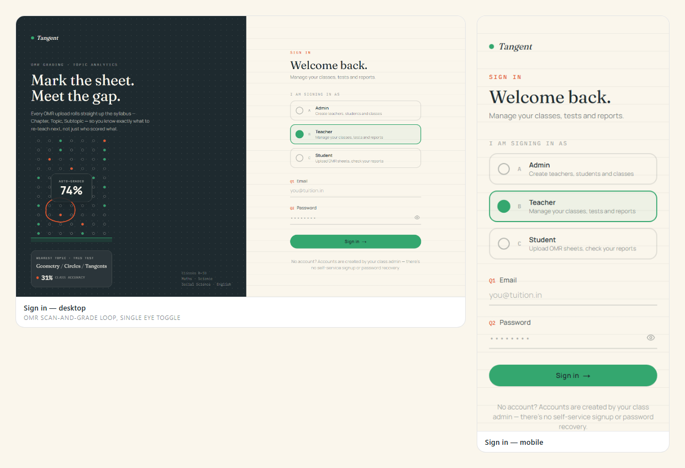
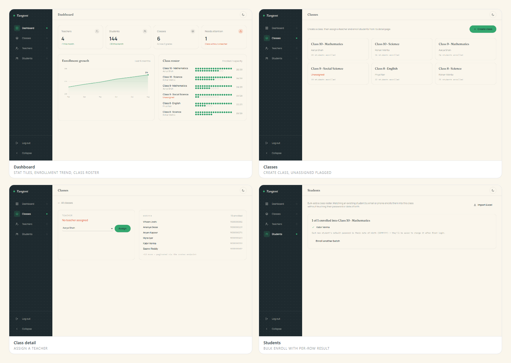
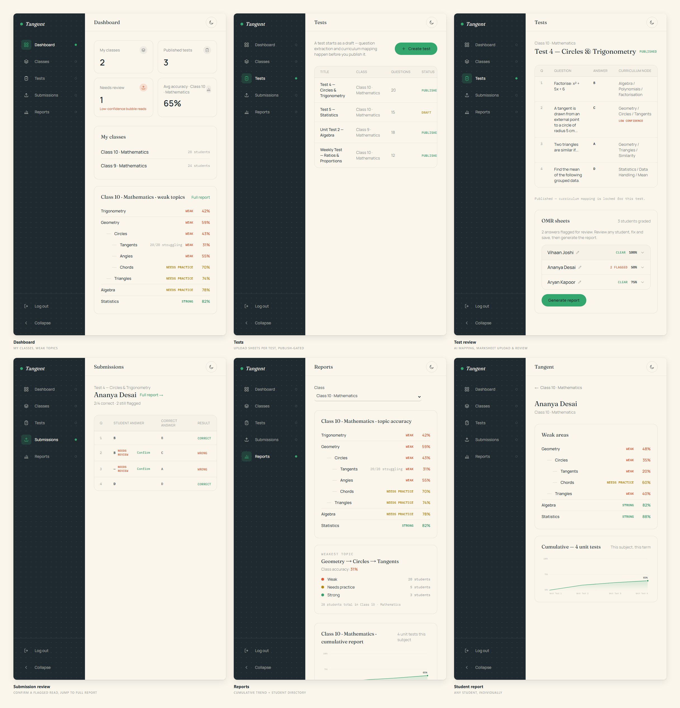
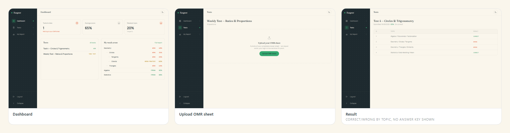
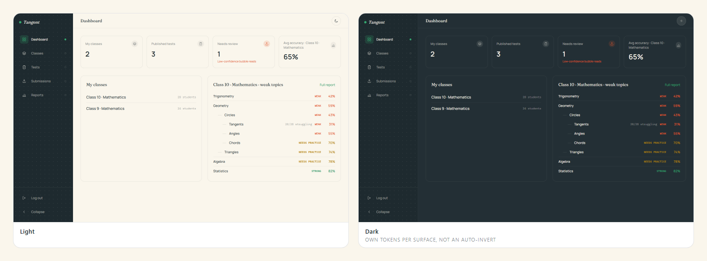
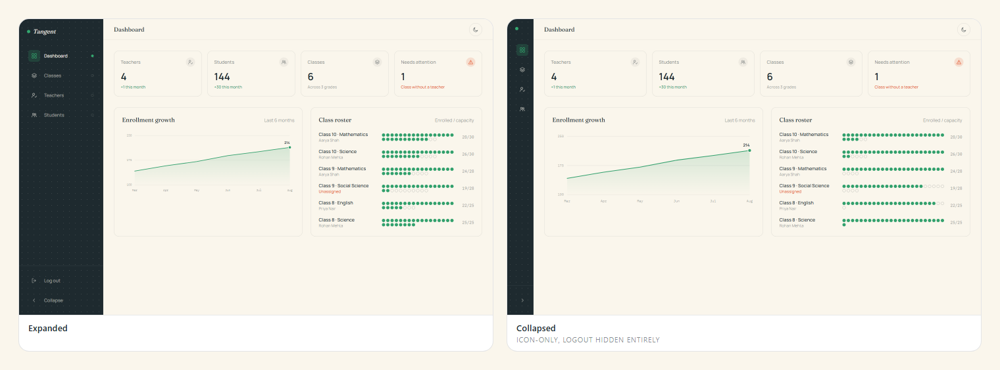

# Tangent — UI Design

Frontend design for the Learning Management platform's OMR grading and topic-analytics
product — see the root [`docs/`](../docs) for the product/backend spec this is built
against. Next.js (App Router) + TypeScript + Tailwind CSS v4, no backend wired up yet —
every page runs on mock data in [`src/lib/mock-data.ts`](src/lib/mock-data.ts).

Three roles, three separate sidebars: **Admin** (creates teachers/students/classes),
**Teacher** (scoped to their own assigned classes — tests, submissions, reports),
**Student** (their own tests and weak-area report). Admin and Teacher are deliberately
separate roles with separate navigation, not a shared "staff" view.

## Screenshots

### Sign in

The role picker is an OMR bubble (A/B/C, filled/unfilled — same visual language as the
grading product itself), and the left panel loops a scan → grade → score animation.



### Admin

Dashboard charts, class management, and the bulk student-enrollment flow with a
per-row created/failed result.



### Teacher

The core product loop: publish a test with AI-suggested curriculum mapping, upload the
whole class's OMR sheets as one PDF, let grading process them, then review each
student's answers — fix and save any flagged read, even correct a misread name — before
generating the report. From there, confirm a flagged bubble read on an individual
submission, and drill from the class-wide cumulative report into any student's own
report.



### Student

A test with no submission yet just says so — grading is teacher-uploaded per class, not
self-service. A graded test shows a result broken down by topic (correct/wrong only,
never the answer key) plus a personal weak-areas report.



### Dark mode

Its own token set per surface (sidebar always ink, content area switches
paper/slate) — not a blanket CSS invert.



### Sidebar collapse

Icon-only when collapsed; Log out disappears entirely rather than shrinking to an icon.



## Stack

- Next.js 16 (App Router) + React 19 + TypeScript
- Tailwind CSS v4 (`@theme` tokens in `src/app/globals.css`)
- anime.js v4 for the login page's OMR loop and icon micro-interactions
- No component library — hand-built primitives in `src/components/ui`

## Getting started

```bash
npm install
npm run dev
```

Opens at `/login`. Pick a role to reach `/admin`, `/teacher`, or `/student` — this is
client-side routing only, there's no real authentication yet.